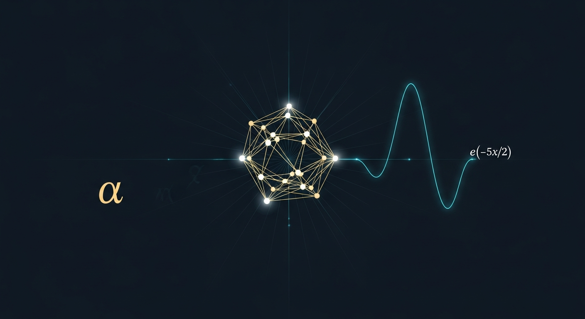

# A High-Precision Phenomenological Relation for Newton's Constant

[](https://doi.org/10.5281/zenodo.20120946)
[](https://creativecommons.org/licenses/by/4.0/)



A single closed-form expression that reproduces Newton's gravitational constant `G` from the electron mass, the reduced Planck constant, the speed of light, and the fine-structure constant alone:

```
G  =  (4/3) · (ℏ c / m_e²) · α²¹ · exp(−5α/2)
```

Evaluated at CODATA 2022, this matches the measured value of `G` to within the 2.2 × 10⁻⁵ relative uncertainty of the CODATA value itself. The relation was discovered by an exhaustive bounded equation search across hundreds of millions of candidates and survived a battery of sham-parity, swap, and family-classification tests designed to rule out numerical accidents.

The paper documents what the relation does and does not claim. It claims that the closed form is an empirical match to seven significant figures with no free parameters. It does **not** claim a derivation from first principles, nor a mechanism. The exponents `(21, 5/2)` are reported as a phenomenological fingerprint with a discussion of which symmetry-group dimensions (B₃, SO(7), SO(8)) make those integers structurally natural, and a transparent ledger of what would be required to upgrade the relation from coincidence to mechanism.

---

## Statement of AI Authorship

**This research and the manuscript were carried out by an orchestration of AI agents under the named author's direction.**

The author is an independent researcher, not a physicist. He set the question — *"is there a closed-form expression for G in the known fundamental constants?"* — and provided direction, sanity checks, and the final go/no-go on every public artifact. He did not derive the equation, write the search engine, run the enumeration, perform the sham-parity tests, or draft the paper. Those were done by Claude, GPT, Gemini, and Deepseek agents working in a multi-model council with adversarial review and quorum gates.

The point of releasing this paper as-is is not to claim that the author personally did physics he is not trained to do. The point is the opposite: to demonstrate that a layperson, given a frontier-model AI orchestration, can pose a serious physics question and have it carried end-to-end through literature survey, hypothesis generation, exhaustive symbolic search, falsification testing, manuscript drafting, and self-publication — with the human acting only as director and gatekeeper.

If the relation turns out to be a coincidence, that fact will also have been discovered by AI agents, and that is the result. The author's contribution is the question and the responsibility for publication; the work is the agents'.

---

## Repository contents

| Path | Description |
|---|---|
| `paper.pdf` | Final compiled manuscript (twocolumn, pdfLaTeX) |
| `paper_source/paper.tex` | LaTeX source |
| `paper_source/preamble.tex` | LaTeX preamble (hyperref, microtype, amsmath, etc.) |
| `public_proof_package/` | Full reproducibility bundle: search engine source, CSV ledgers, sham-parity outputs, benchmark JSON, scope statement |
| `assets/cover.png` | Cover image (B₃ root system silhouette with the α-decay envelope) |
| `LICENSE` | CC-BY 4.0 |

The `public_proof_package/` directory contains the bounded-equation-search engine (`av6_engine/`), the canonical declared prior, the top-candidate CSV ledgers under CODATA 2022 and NIST 2026 benchmarks, the mechanism-gap routes table, and a `SCOPE.md` that states explicitly what the paper does and does not claim.

## How to cite

```bibtex
@misc{dvorak2026gnewton,
  author       = {Dvo{\v r}{\'a}k, Old{\v r}ich},
  title        = {A High-Precision Phenomenological Relation for Newton's Constant},
  year         = 2026,
  publisher    = {Zenodo},
  doi          = {10.5281/zenodo.20120946},
  url          = {https://doi.org/10.5281/zenodo.20120946}
}
```

The DOI `10.5281/zenodo.20120946` resolves to the published version. The all-versions concept DOI `10.5281/zenodo.20120945` resolves to whichever version is current; for citation purposes prefer the version DOI to lock the exact snapshot that was reviewed.

## Contact

Oldřich Dvořák — independent researcher — `oldrich@oldrich.me`

## License

Creative Commons Attribution 4.0 International (CC BY 4.0). You may copy, redistribute, remix, transform, and build upon the material in any medium, including commercially, provided appropriate credit is given.
